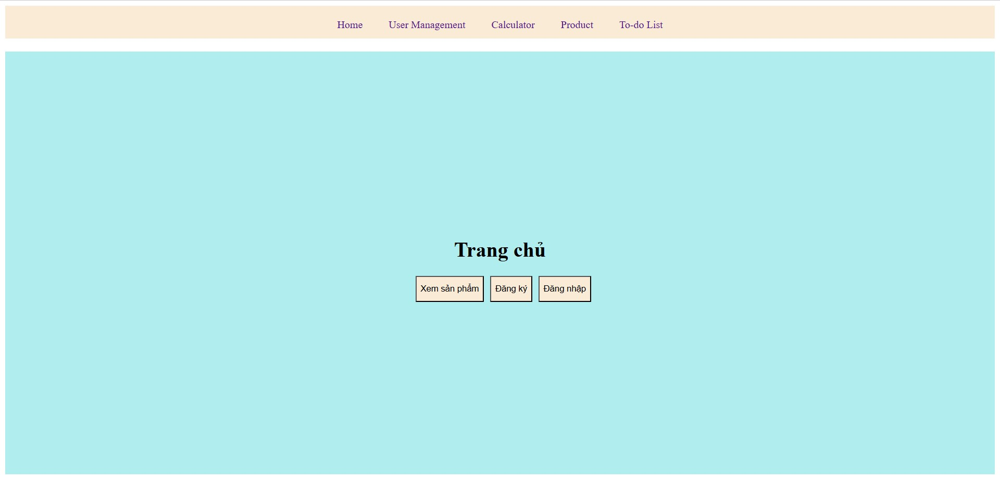
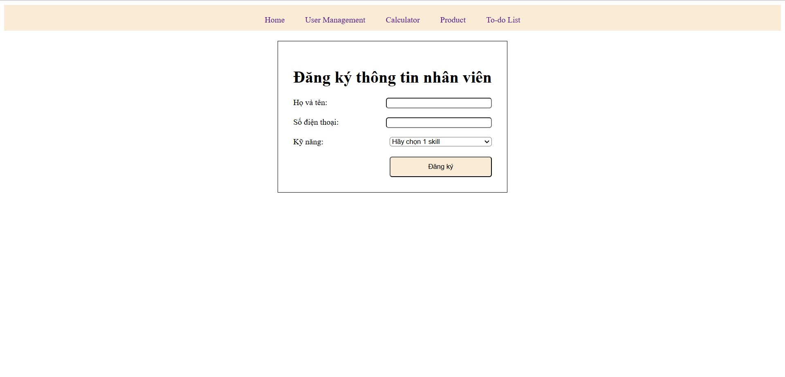
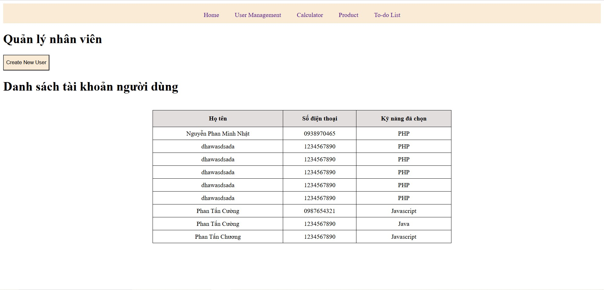
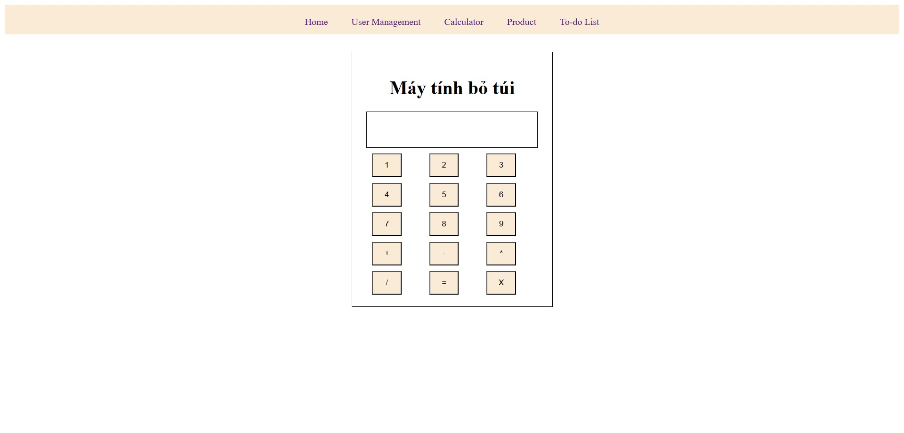
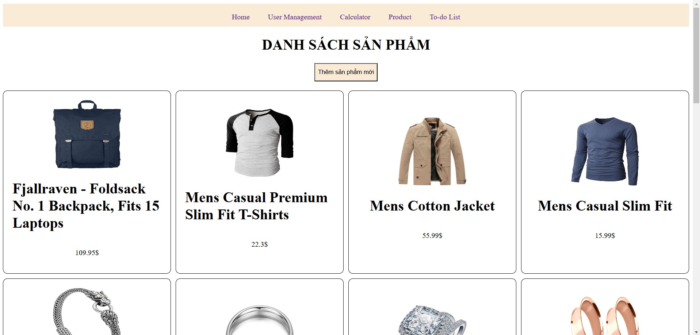
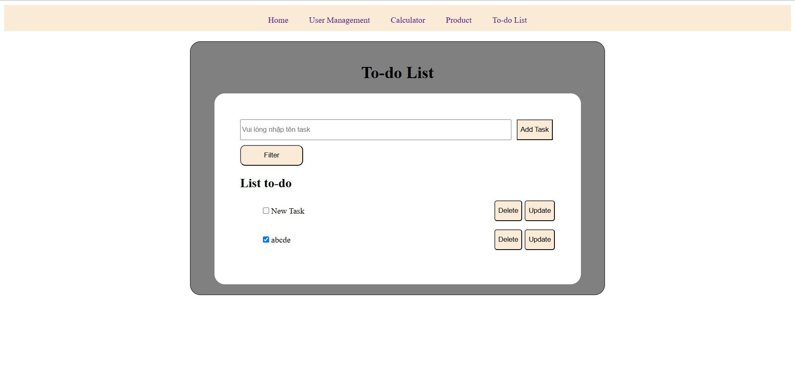

# Vue Practice Project

This project contains a series of exercises for practicing and improving skills with Vue.js 3 using Vite. These tasks include interface design, form handling, calculators, product listing from an API, and a CRUD to-do list app.

## Features and Exercises

### 1. Homepage Interface Design
A simple homepage interface to get started with Vue's basic templating and styling.


### 2. Create User Form with Validation
A user creation form with real-time validation for handling inputs and form submissions.


### 3. User Management Table View
Display a table of users with options for sorting, filtering, and managing user records.


### 4. Calculator
A functional calculator using Vue's reactivity system, complete with basic arithmetic operations.


### 5. Product List from FakeStore API
Fetch and display a list of products from the FakeStore API, with pagination and filtering.


### 6. To-Do List with CRUD Functionality
A classic to-do list application that allows users to Create, Read, Update, and Delete tasks.


## Recommended IDE Setup

- [VSCode](https://code.visualstudio.com/)
- [Volar Extension](https://marketplace.visualstudio.com/items?itemName=Vue.volar) (disable Vetur for Vue 3 support)

## Customize Configuration

See [Vite Configuration Reference](https://vite.dev/config/) for more details.

## Project Setup

To install dependencies, run:

```sh
npm install
